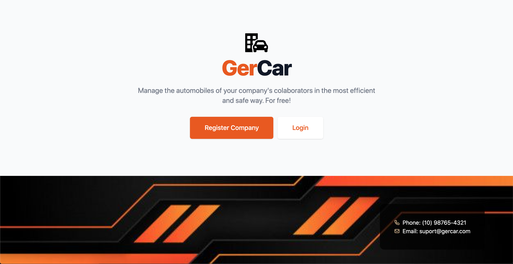

## About GerCar

GerCar was mainly built in Laravel (laravel.com), Vue.js (vuejs.org), Tailwind (tailwindcss.com) e Kool.dev (kool.dev).

It's main utility is the identification of vehicles and their relationship with companies and colaborators. The idea was inpired by the fact that the Firework's team workplace is located in a hub of innovation, the Conq Hub (conq.com.br), that shares space with many other companies. With GerCar, if someone sees a car that needs attention, it can be identified and people can find its owner.